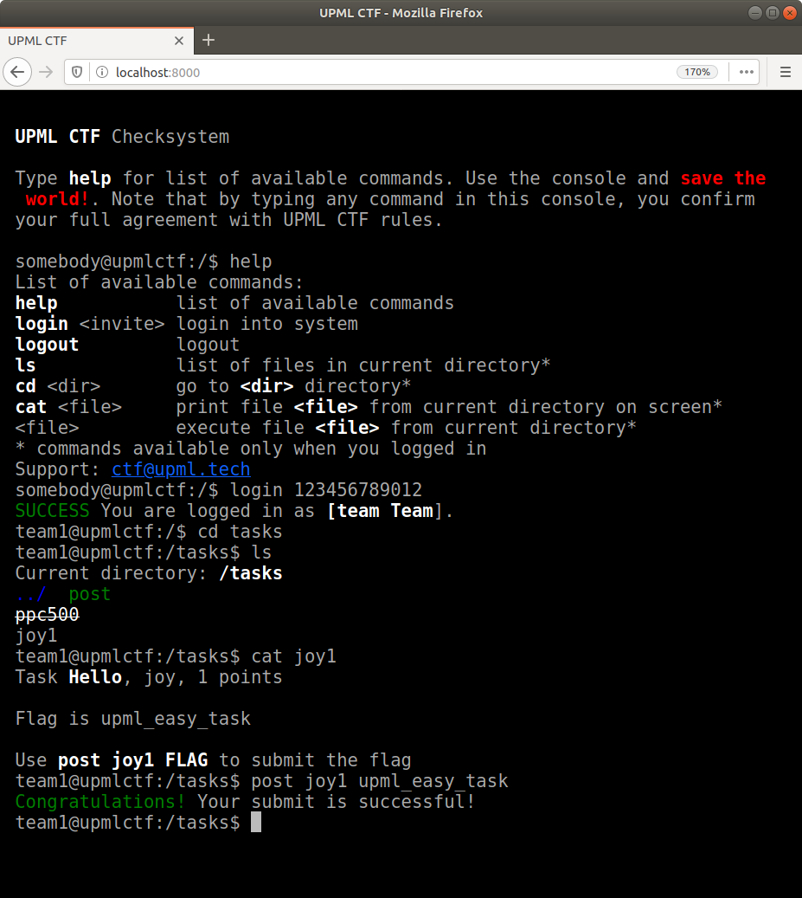

# Борда UPML CTF 2016

* Автор — [Никита Сычев](https://github.com/nsychev).
* Лицензия — [MIT](LICENSE)



# Инструкции по использованию

Это — приложение на Django 1.x.

Дебаг-режим:
```bash
python3 manage.py runserver
```

Создать пользователя админки:
```bash
python3 manage.py createsuperuser
```

Продакшн:
```bash
gunicorn -b 127.0.0.1:40000 ctf.wsgi:application
```

Не забудьте убрать дебаг-режим в `ctf/settings.py` и поставить nginx в качестве реверс-прокси.
